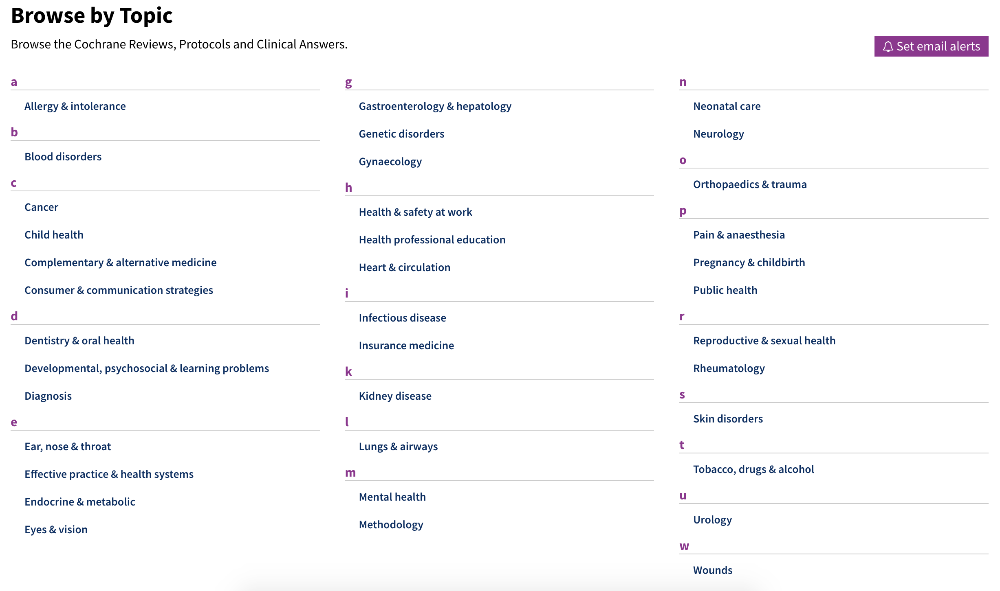

# Appraising the Potential Uses and Harms of Large Language Models (LLMs) for Medical Systematic Reviews

## Evidence Summaries Generated by LLMs

This repository provides the details of generating evidence summaries using LLMs.

### List of Cochrane Review Titles and LLM-Generated Reviews

In February 2023, we queried the most recently published titles of Cochrane reviews for each of the 37 Cochrane medical topics and used those titles as prompts to generate the evidence summaries after removing duplicate titles. 
The topics span a diverse variety of subjects from `Allergy & Intolerance` to `Health Professional Education`. The full list of 37 Cochrane medical topics is shown below.



Please refer to `cochrane_reviews_latest_by_topic_20230223.csv` for a full list of Cochrane review titles used to generate 128 reviews/summaries using LLMs.
We specifically chose titles of systematic reviews that were published or updated after the latest training dates of the LLMs we considered for this study to mitigate the risk of models having seen the latest versions of reviews in training. We removed any duplicate titles.

`llm_outputs.csv` includes all the LLM-generated reviews.
A subset of outputs have been selected for the domain expert interviews. They are available at https://llm4msr.netlify.app/

## Code for Generating Reviews

This section provides the details of generating medical systematic reviews using BioMedLM and Galactica. Reviews from ChatGPT were generated using the web interface.

The Galactica model can be accessed via [Huggingface](https://huggingface.co/facebook/galactica-6.7b) or `pip install galai`.
The BioMedLM can be accessed via [Huggingface](https://huggingface.co/stanford-crfm/BioMedLM).
To install all the dependencies for accessing the models, you can follow the instructions under [Setup section](#setup).

`get_outputs_for_cochrane_titles_galactica_biomedlm.ipynb` includes the code.

### Setup

Create conda environment from the environment.yml: `conda env create -f environment.yml`

Activate the conda environment: `conda activate llm4msr`

Run the jupyter notebook `get_outputs_for_cochrane_titles_galactica_biomedlm.ipynb` to generate outputs for the 128 titles.

## Represenative Output Samples (Website)

We created a website which was presented to participants during the interviews. The website includes information on high-level background of large language models and representative samples of outputs generated from LLMs.

The representative samples were used as a starting point of a discussion with domain experts on the potential uses and harms of LLMs for medical systematic reviews.

The link to the website: https://llm4msr.netlify.app/

## Citation

```bibtex
@article{yun2023appraising,
  title={Appraising the Potential Uses and Harms of LLMs for Medical Systematic Reviews},
  author={Yun, Hye Sun and Marshall, Iain J and Trikalinos, Thomas and Wallace, Byron C},
  journal={arXiv preprint arXiv:2305.11828},
  year={2023}
}
```
